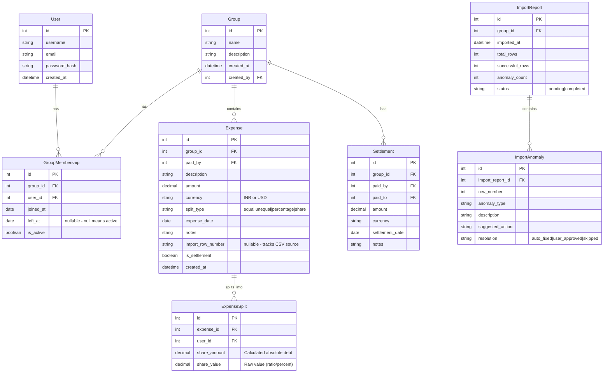

# Project Scope & Specifications

## 1. Complete Anomaly Log & Resolution Policies

During the processing of `Expenses Export.csv`, the Importer Engine detects 17 specific anomalies across 15+ rows. Here is the comprehensive log of these issues and how the engine processes them:

| Row(s) | Anomaly Description | Detection Type | Implemented Handling Policy |
|--------|---------------------|----------------|-----------------------------|
| 5–6 | **Duplicate expense** ("Dinner at Marina Bites" logged twice, same date/amount) | `duplicate_expense` | Detected via identical hash of core fields. Flagged as `warning`. Both rows presented to user, who must pick which one to skip during Review. |
| 7 | **Comma-formatted amount** (`"1,200"`) | `invalid_amount` | Detected during amount parsing. `auto_fixed` by stripping commas and non-numeric characters. Parsed safely as `1200`. |
| 9 | **Inconsistent name casing** (`priya` vs `Priya`) | `name_normalization` | Case-insensitive match maps it cleanly to the `Priya` User instance. Handled silently (no anomaly raised). |
| 10 | **Excessive decimal precision** (`899.995`) | `invalid_amount` | Detected during amount cast. `auto_fixed` by utilizing Bankers Rounding (ROUND_HALF_UP) down to 2 decimal places (`900.00`). |
| 11 | **Name variant** (`Priya S`) | `name_mismatch` | Detected as name variant. Flagged as `warning`. **Policy:** Recommends "Confirm to merge with Priya" instead of blindly auto-correcting it, to prevent data destruction. |
| 13 | **Missing payer** (`paid_by` empty) | `missing_field` | Flagged as `critical` error. Importer skips this row entirely unless the user provides a valid user manually. |
| 14 | **Settlement logged as expense** ("Rohan paid Aisha back") | `misclassification` | Detected via keyword scanning ("paid...back", "settlement"). `auto_fixed` by marking `is_settlement=True` and changing the import decision to "Settlement". |
| 15, 32 | **Percentages sum to 110%** (`30+30+30+20`) | `math_error` | Flagged as `error`. Requires user to correct ratios, or skips row. |
| 23 | **Non-member in split** (`Dev's friend Kabir`) | `name_mismatch` | Flagged as `warning`. **Policy:** The backend will automatically provision a temporary User account for Kabir and backdate his membership to join the group. |
| 24–25 | **Conflicting duplicate** (Thalassa dinner logged as ₹2400 and ₹2450) | `duplicate_expense` | Flagged as `warning`. The user must review the descriptions (Note: "hers is wrong") and manually click "Skip" on the incorrect row. |
| 26 | **Negative amount** (`-30 USD` refund) | `negative_amount` | Detected during cast. `auto_fixed` to its absolute value (`30`), but flagged internally. Re-applied as a refund in balance calculation. |
| 27 | **Malformed date** (`Mar-14` instead of `DD-MM-YYYY`) | `date_normalized` | `auto_fixed` using flexible `dateutil.parser`. Converted strictly to `14-03-2026` and surfaced as a benign `info` notice. |
| 28 | **Missing currency** | `currency_normalized` | `auto_fixed` by defaulting to `INR` and surfaced as a benign `info` notice to reduce visual noise. |
| 31 | **Zero-amount expense** (`0 INR`) | `zero_amount` | Flagged as `warning`. Importer engine automatically defaults the auto-decision to `Skip (needs review)` to prevent importing dead placeholders. |
| 34 | **Ambiguous date** (`04-05-2026` could be April 5 or May 4) | `date_normalized` | Detected format inconsistency. `auto_fixed` by forcing the standard DD-MM-YYYY format matching the rest of the document (May 4th). Surfaced as `info`. |
| 36 | **Ex-member in split** (Meera included in April after moving out) | `membership_violation` | Flagged as `error`. Meera is removed from the split array, and the expense is divided equally among the remaining participants. |
| 42 | **Contradictory split** (`equal` but shares provided) | `contradictory_split` | `auto_fixed` by trusting the `split_type` (equal) because the shares evaluated to equal ratios anyway (1:1:1:1). |

---

## 2. Database Schema

The backend uses a normalized PostgreSQL/SQLite relational schema via Django ORM.

### ER Diagram

### Key Schema Decisions
- **ExpenseSplit:** Rather than just storing the "ratio" (e.g. 30%), the system explicitly computes and stores `share_amount` (e.g., ₹300) in the database at the time of creation. This ensures historical immutability. If the total changes, splits must be rebuilt.
- **GroupMembership:** Uses `joined_at` and `left_at` specifically to support the assignment's rule regarding Sam joining late and Meera leaving early.
- **ImportReport:** Creates a permanent audit log of the CSV import, tying anomalies back to exactly what line they occurred on in the raw file.
